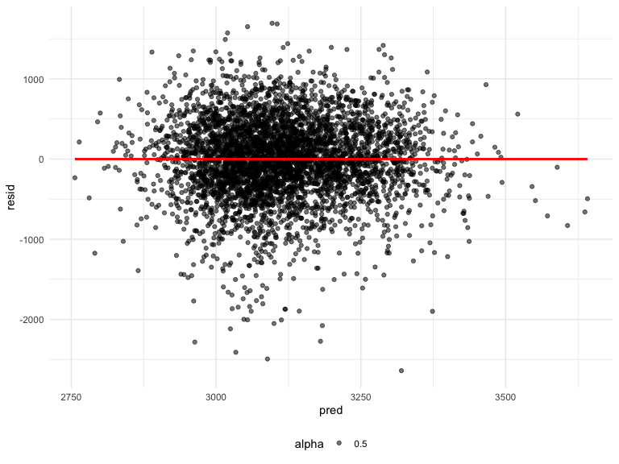
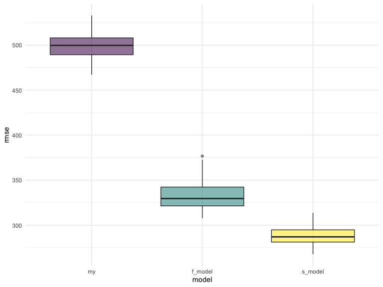

Homework 6
================
Paula Wu
11/23/2021

Import the libraries

``` r
library(tidyverse)
library(viridis)
library(modelr)
library(patchwork)
```

## Problem 1

#### Data Preprocessing

Read in data and data cleaning

``` r
birth_weight_df = read_csv("./data/birthweight.csv") %>% 
  janitor::clean_names() %>% 
  mutate(babysex = as.factor(babysex),
         malform = as.factor(malform),
         frace = as.factor(frace),
         mrace = as.factor(mrace))
knitr::kable(birth_weight_df[1:7,])
```

| babysex | bhead | blength |  bwt | delwt | fincome | frace | gaweeks | malform | menarche | mheight | momage | mrace | parity | pnumlbw | pnumsga |    ppbmi | ppwt | smoken | wtgain |
|:--------|------:|--------:|-----:|------:|--------:|:------|--------:|:--------|---------:|--------:|-------:|:------|-------:|--------:|--------:|---------:|-----:|-------:|-------:|
| 2       |    34 |      51 | 3629 |   177 |      35 | 1     |    39.9 | 0       |       13 |      63 |     36 | 1     |      3 |       0 |       0 | 26.27184 |  148 |      0 |     29 |
| 1       |    34 |      48 | 3062 |   156 |      65 | 2     |    25.9 | 0       |       14 |      65 |     25 | 2     |      0 |       0 |       0 | 21.34485 |  128 |      0 |     28 |
| 2       |    36 |      50 | 3345 |   148 |      85 | 1     |    39.9 | 0       |       12 |      64 |     29 | 1     |      0 |       0 |       0 | 23.56517 |  137 |      1 |     11 |
| 1       |    34 |      52 | 3062 |   157 |      55 | 1     |    40.0 | 0       |       14 |      64 |     18 | 1     |      0 |       0 |       0 | 21.84508 |  127 |     10 |     30 |
| 2       |    34 |      52 | 3374 |   156 |       5 | 1     |    41.6 | 0       |       13 |      66 |     20 | 1     |      0 |       0 |       0 | 21.02642 |  130 |      1 |     26 |
| 1       |    33 |      52 | 3374 |   129 |      55 | 1     |    40.7 | 0       |       12 |      66 |     23 | 1     |      0 |       0 |       0 | 18.60030 |  115 |      0 |     14 |
| 2       |    33 |      46 | 2523 |   126 |      96 | 2     |    40.3 | 0       |       14 |      72 |     29 | 2     |      0 |       0 |       0 | 14.27034 |  105 |      0 |     21 |

Check for missing values

``` r
birth_weight_df %>% 
  select(everything()) %>%  
  summarise_all(funs(sum(is.na(.)))) %>% 
  knitr::kable()
```

| babysex | bhead | blength | bwt | delwt | fincome | frace | gaweeks | malform | menarche | mheight | momage | mrace | parity | pnumlbw | pnumsga | ppbmi | ppwt | smoken | wtgain |
|--------:|------:|--------:|----:|------:|--------:|------:|--------:|--------:|---------:|--------:|-------:|------:|-------:|--------:|--------:|------:|-----:|-------:|-------:|
|       0 |     0 |       0 |   0 |     0 |       0 |     0 |       0 |       0 |        0 |       0 |      0 |     0 |      0 |       0 |       0 |     0 |    0 |      0 |      0 |

As we can see from above, no missing values appeared in the data set.
Thus, no imputation is needed. <br>

#### Regression

**My proposed model**:<br> I did some research on potential factors that
could affect infants’ birth weights: “Low birth weight is associated
with many socio-economic factors such as residence, mother’s age and
occupation, birth order, the family’s income and many maternal
conditions such as nutritional status, mother’s educational and health
status \[1\].” <br><br>

Thus, I proposed my model to explore the associations among: `fincome`
(family income), `momage` (mother’s age at delivery), `parity`(to
approximate birth order), `smoken` and `ppbmi` (to approximate maternal
conditions).

``` r
my_model_fit = lm(bwt ~ fincome + momage + parity + smoken + ppbmi, data = birth_weight_df)
broom::tidy(my_model_fit)
```

    ## # A tibble: 6 × 5
    ##   term        estimate std.error statistic   p.value
    ##   <chr>          <dbl>     <dbl>     <dbl>     <dbl>
    ## 1 (Intercept)  2465.      63.1      39.1   2.82e-286
    ## 2 fincome         2.63     0.310     8.49  2.78e- 17
    ## 3 momage         12.3      2.08      5.89  4.07e-  9
    ## 4 parity        -48.4     73.9      -0.656 5.12e-  1
    ## 5 smoken         -6.48     1.03     -6.30  3.28e- 10
    ## 6 ppbmi          14.4      2.39      6.03  1.80e-  9

Plot residual plots

``` r
birth_weight_df %>% 
  modelr::add_residuals(my_model_fit) %>%
  modelr::add_predictions(my_model_fit) %>% 
  ggplot(aes(x = pred, y = resid))+
  geom_point(aes(alpha = 0.5))+
  geom_smooth(se = FALSE, method = lm, color = "red")
```

    ## `geom_smooth()` using formula 'y ~ x'


**Compared to other two models**:<br> First model: using length at birth
and gestational age as predictors (main effects only)

``` r
f_model_fit = lm(bwt ~ blength + gaweeks, data = birth_weight_df) 
broom::tidy(f_model_fit)
```

    ## # A tibble: 3 × 5
    ##   term        estimate std.error statistic  p.value
    ##   <chr>          <dbl>     <dbl>     <dbl>    <dbl>
    ## 1 (Intercept)  -4348.      98.0      -44.4 0       
    ## 2 blength        129.       1.99      64.6 0       
    ## 3 gaweeks         27.0      1.72      15.7 2.36e-54

Second model:using head circumference, length, sex, and all interactions
(including the three-way interaction) between these

``` r
s_model_fit = lm(bwt ~ bhead + blength + babysex + bhead*blength 
                 + bhead*babysex + blength*babysex + bhead*blength*babysex, 
                 data = birth_weight_df)
broom::tidy(s_model_fit)
```

    ## # A tibble: 8 × 5
    ##   term                    estimate std.error statistic      p.value
    ##   <chr>                      <dbl>     <dbl>     <dbl>        <dbl>
    ## 1 (Intercept)            -7177.     1265.       -5.67  0.0000000149
    ## 2 bhead                    182.       38.1       4.78  0.00000184  
    ## 3 blength                  102.       26.2       3.90  0.0000992   
    ## 4 babysex2                6375.     1678.        3.80  0.000147    
    ## 5 bhead:blength             -0.554     0.780    -0.710 0.478       
    ## 6 bhead:babysex2          -198.       51.1      -3.88  0.000105    
    ## 7 blength:babysex2        -124.       35.1      -3.52  0.000429    
    ## 8 bhead:blength:babysex2     3.88      1.06      3.67  0.000245

``` r
cv_df = 
  crossv_mc(birth_weight_df,100) %>% 
  mutate(
    train = map(train, as_tibble),  # transform to tibble
    test = map(test, as_tibble)
  )
cv_df = 
  cv_df %>% 
  mutate(
    my_model_fit = map(.x = train, ~lm(bwt ~ fincome + momage + parity + smoken + ppbmi, data = .x)),
    f_model_fit = map(.x = train, ~lm(bwt ~ blength + gaweeks, data = .x) ),
    s_model_fit = map(.x = train, ~lm(bwt ~ bhead + blength + babysex + bhead*blength 
                 + bhead*babysex + blength*babysex + bhead*blength*babysex, 
                 data = .x))
  ) %>% 
  mutate(
    rmse_my = map2_dbl(.x = my_model_fit, .y = test, ~rmse(model = .x, data = .y)),
    rmse_f_model = map2_dbl(.x = f_model_fit, .y = test, ~rmse(model = .x, data = .y)),
    rmse_s_model = map2_dbl(.x = s_model_fit, .y = test, ~rmse(model = .x, data = .y))
  )
```

Look at the results

``` r
cv_df %>% 
  select(starts_with("rmse")) %>% 
  pivot_longer(
    everything(),
    names_to = "model",
    values_to = "rmse",
    names_prefix = "rmse_"
  ) %>% 
  mutate(model = fct_relevel(model, "my", "f_model", "s_model")) %>% 
  ggplot(aes(x = model, y = rmse,))+
  geom_boxplot(aes(fill = model, alpha = 0.3))+
  theme(legend.position = "none")
```



## Problem 2

Load in the data, codes copied from homework website

``` r
weather_df = 
  rnoaa::meteo_pull_monitors(
    c("USW00094728"),
    var = c("PRCP", "TMIN", "TMAX"), 
    date_min = "2017-01-01",
    date_max = "2017-12-31") %>%
  mutate(
    name = recode(id, USW00094728 = "CentralPark_NY"),
    tmin = tmin / 10,
    tmax = tmax / 10) %>%
  select(name, id, everything())
```

Set the seed to ensure I can get the same results each time I ran my
code

``` r
set.seed(1) 
```

### R-squared

``` r
r_squared_results = 
  weather_df %>% 
  bootstrap(n = 5000, id = "strap_number") %>% 
  mutate(
    models = map(.x = strap, ~lm(tmax~tmin, data = .x)),
    results = map(models, broom::glance)
  ) %>% 
  select(-models, -strap) %>% 
  unnest(results) %>% 
  janitor::clean_names()  # the variable names are not that cleaned
r_squared_results %>% 
  summarize(
    ci_lower = quantile(r_squared, 0.025),
    ci_upper = quantile(r_squared, 0.975)
  )
```

    ## # A tibble: 1 × 2
    ##   ci_lower ci_upper
    ##      <dbl>    <dbl>
    ## 1    0.894    0.927

#### log(beta_0 \* beta_1)

``` r
log_beta_results = 
  weather_df %>% 
  bootstrap(n = 5000, id = "strap_number") %>% 
  mutate(
    models = map(.x = strap, ~lm(tmax~tmin, data = .x)),
    results = map(models, broom::tidy)
  ) %>% 
  select(-models, -strap) %>% 
  unnest(results) %>% 
  select(strap_number, term, estimate) %>% 
  pivot_wider(names_from = term, values_from = estimate) %>% 
  janitor::clean_names() %>% 
  mutate(log_beta_zo = log(intercept*tmin))

log_beta_results %>% 
  summarize(
    ci_lower = quantile(log_beta_zo, 0.025),
    ci_upper = quantile(log_beta_zo, 0.975)
  )
```

    ## # A tibble: 1 × 2
    ##   ci_lower ci_upper
    ##      <dbl>    <dbl>
    ## 1     1.96     2.06

#### Plots

``` r
# r squared
r_squared_results %>% 
  ggplot(aes(x = r_squared))+  # plot the estimate
  geom_density()
```


``` r
log_beta_results %>% 
  ggplot(aes(x = log_beta_zo))+  # plot the estimate
  geom_density() 
```


## Reference

\[1\] Maternal Associated Factors of Low Birth Weight
