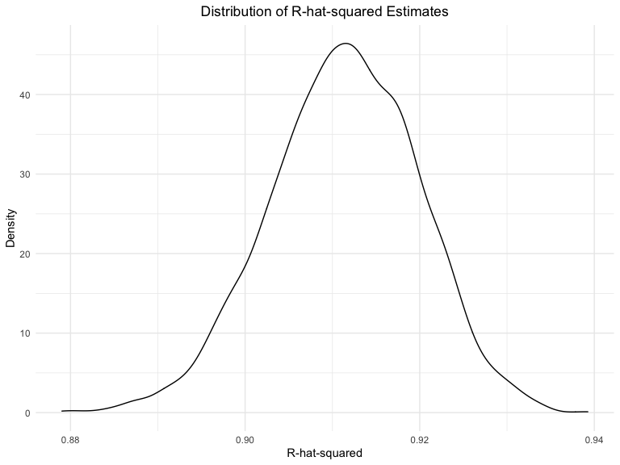

Homework 6
================
Paula Wu
11/23/2021

Import the libraries

``` r
library(tidyverse)
library(viridis)
library(modelr)
library(patchwork)
```

Set the seed to ensure I can get the same results each time I ran my
code

``` r
set.seed(100) 
```

## Problem 1

#### Data Preprocessing

Read in data and data cleaning

``` r
birth_weight_df = read_csv("./data/birthweight.csv") %>% 
  janitor::clean_names() %>% 
  mutate(babysex = as.factor(babysex),
         malform = as.factor(malform),
         frace = as.factor(frace),
         mrace = as.factor(mrace))
knitr::kable(birth_weight_df[1:7,])  # choose to display first 7 rows on purpose
```

| babysex | bhead | blength |  bwt | delwt | fincome | frace | gaweeks | malform | menarche | mheight | momage | mrace | parity | pnumlbw | pnumsga |    ppbmi | ppwt | smoken | wtgain |
|:--------|------:|--------:|-----:|------:|--------:|:------|--------:|:--------|---------:|--------:|-------:|:------|-------:|--------:|--------:|---------:|-----:|-------:|-------:|
| 2       |    34 |      51 | 3629 |   177 |      35 | 1     |    39.9 | 0       |       13 |      63 |     36 | 1     |      3 |       0 |       0 | 26.27184 |  148 |      0 |     29 |
| 1       |    34 |      48 | 3062 |   156 |      65 | 2     |    25.9 | 0       |       14 |      65 |     25 | 2     |      0 |       0 |       0 | 21.34485 |  128 |      0 |     28 |
| 2       |    36 |      50 | 3345 |   148 |      85 | 1     |    39.9 | 0       |       12 |      64 |     29 | 1     |      0 |       0 |       0 | 23.56517 |  137 |      1 |     11 |
| 1       |    34 |      52 | 3062 |   157 |      55 | 1     |    40.0 | 0       |       14 |      64 |     18 | 1     |      0 |       0 |       0 | 21.84508 |  127 |     10 |     30 |
| 2       |    34 |      52 | 3374 |   156 |       5 | 1     |    41.6 | 0       |       13 |      66 |     20 | 1     |      0 |       0 |       0 | 21.02642 |  130 |      1 |     26 |
| 1       |    33 |      52 | 3374 |   129 |      55 | 1     |    40.7 | 0       |       12 |      66 |     23 | 1     |      0 |       0 |       0 | 18.60030 |  115 |      0 |     14 |
| 2       |    33 |      46 | 2523 |   126 |      96 | 2     |    40.3 | 0       |       14 |      72 |     29 | 2     |      0 |       0 |       0 | 14.27034 |  105 |      0 |     21 |

Check for missing values

``` r
birth_weight_df %>% 
  select(everything()) %>%  
  summarise_all(funs(sum(is.na(.)))) %>% 
  knitr::kable()
```

| babysex | bhead | blength | bwt | delwt | fincome | frace | gaweeks | malform | menarche | mheight | momage | mrace | parity | pnumlbw | pnumsga | ppbmi | ppwt | smoken | wtgain |
|--------:|------:|--------:|----:|------:|--------:|------:|--------:|--------:|---------:|--------:|-------:|------:|-------:|--------:|--------:|------:|-----:|-------:|-------:|
|       0 |     0 |       0 |   0 |     0 |       0 |     0 |       0 |       0 |        0 |       0 |      0 |     0 |      0 |       0 |       0 |     0 |    0 |      0 |      0 |

As we can see from above, no missing values appeared in the data set.
Thus, no imputation is needed. <br>

#### Regression

**My proposed model**:<br> I did some research on potential factors that
could affect infants’ birth weights: “Low birth weight is associated
with many socio-economic factors such as residence, mother’s age and
occupation, birth order, the family’s income and many maternal
conditions such as nutritional status, mother’s educational and health
status \[1\].” <br>

Based on the information mentioned above, I proposed my model to explore
the associations among (i.e. my model will include the following
predictors): `fincome` (family income), `momage` (mother’s age at
delivery), `parity`(to approximate birth order), `smoken` and `ppbmi`
(to approximate maternal conditions).

``` r
my_model_fit = lm(bwt ~ fincome + momage + parity + smoken + ppbmi, data = birth_weight_df)
broom::tidy(my_model_fit) %>% 
  knitr::kable()
```

| term        |    estimate |  std.error |  statistic |   p.value |
|:------------|------------:|-----------:|-----------:|----------:|
| (Intercept) | 2464.784333 | 63.0945654 | 39.0649229 | 0.0000000 |
| fincome     |    2.630156 |  0.3097683 |  8.4907180 | 0.0000000 |
| momage      |   12.277460 |  2.0831907 |  5.8935844 | 0.0000000 |
| parity      |  -48.442640 | 73.8896675 | -0.6556078 | 0.5121113 |
| smoken      |   -6.480009 |  1.0286391 | -6.2995947 | 0.0000000 |
| ppbmi       |   14.434897 |  2.3948045 |  6.0275889 | 0.0000000 |

Plot residual plots

``` r
birth_weight_df %>% 
  modelr::add_residuals(my_model_fit) %>%
  modelr::add_predictions(my_model_fit) %>% 
  ggplot(aes(x = pred, y = resid))+
  geom_point(alpha = 0.5)+
  geom_smooth(se = FALSE, method = lm, color = "red")+
  geom_hline(yintercept= 0, linetype = "dashed", col = "blue")+  # a horizontal line for reference
  ggtitle("Model Residuals vs. Fitted Values") +
  theme(plot.title = element_text(hjust = 0.5)) + 
  labs(y = "Residuals", x = "Fitted Values")
```


<br>We can see that the red smoothed line generated from the residual
points is aligned with the blue horizontal dashed line with y-intercept
= 0. This means our residuals values “bounce” around 0, suggesting that
the assumption that the relationship between predictors and outcome -
the birthweight - is linear is reasonable. <br><br>

**Compared to other two models**:<br> *First model*: using length at
birth and gestational age as predictors (main effects only)

``` r
f_model_fit = lm(bwt ~ blength + gaweeks, data = birth_weight_df) 
broom::tidy(f_model_fit) %>% 
  knitr::kable()
```

| term        |    estimate | std.error | statistic | p.value |
|:------------|------------:|----------:|----------:|--------:|
| (Intercept) | -4347.66707 | 97.958360 | -44.38281 |       0 |
| blength     |   128.55569 |  1.989891 |  64.60439 |       0 |
| gaweeks     |    27.04673 |  1.717930 |  15.74379 |       0 |

*Second model*: using head circumference, length, sex, and all
interactions (including the three-way interaction) between these

``` r
# the second model contains predictors of all interactions
s_model_fit = lm(bwt ~ bhead + blength + babysex + bhead*blength 
                 + bhead*babysex + blength*babysex + bhead*blength*babysex, 
                 data = birth_weight_df)
broom::tidy(s_model_fit) %>% 
  knitr::kable()
```

| term                   |      estimate |    std.error |  statistic |   p.value |
|:-----------------------|--------------:|-------------:|-----------:|----------:|
| (Intercept)            | -7176.8170221 | 1264.8397394 | -5.6740920 | 0.0000000 |
| bhead                  |   181.7956350 |   38.0542051 |  4.7772811 | 0.0000018 |
| blength                |   102.1269235 |   26.2118095 |  3.8962180 | 0.0000992 |
| babysex2               |  6374.8683508 | 1677.7669213 |  3.7996150 | 0.0001469 |
| bhead:blength          |    -0.5536096 |    0.7802092 | -0.7095656 | 0.4780117 |
| bhead:babysex2         |  -198.3931810 |   51.0916850 | -3.8830816 | 0.0001047 |
| blength:babysex2       |  -123.7728875 |   35.1185360 | -3.5244319 | 0.0004288 |
| bhead:blength:babysex2 |     3.8780531 |    1.0566296 |  3.6702106 | 0.0002453 |

<br>Make comparisons in terms of the cross-validated prediction error

``` r
cv_df = 
  crossv_mc(birth_weight_df,100) %>% 
  mutate(
    train = map(train, as_tibble),  # transform to tibble
    test = map(test, as_tibble)
  )
cv_df = 
  cv_df %>% 
  mutate(
    my_model_fit = map(.x = train, ~lm(bwt ~ fincome + momage + parity + smoken + ppbmi, data = .x)),
    f_model_fit = map(.x = train, ~lm(bwt ~ blength + gaweeks, data = .x) ),
    s_model_fit = map(.x = train, ~lm(bwt ~ bhead + blength + babysex + bhead*blength 
                 + bhead*babysex + blength*babysex + bhead*blength*babysex, 
                 data = .x))
  ) %>% 
  mutate(
    rmse_my = map2_dbl(.x = my_model_fit, .y = test, ~rmse(model = .x, data = .y)),
    rmse_f_model = map2_dbl(.x = f_model_fit, .y = test, ~rmse(model = .x, data = .y)),
    rmse_s_model = map2_dbl(.x = s_model_fit, .y = test, ~rmse(model = .x, data = .y))
  )
```

Look at the results

``` r
cv_df %>% 
  select(starts_with("rmse")) %>% 
  pivot_longer(
    everything(),
    names_to = "model",
    values_to = "rmse",
    names_prefix = "rmse_"
  ) %>% 
  mutate(model = fct_relevel(model, "my", "f_model", "s_model")) %>% 
  ggplot(aes(x = model, y = rmse,))+
  geom_violin(aes(fill = model), alpha = 0.5)+
  scale_x_discrete(labels = c("My Model", "First Model", "Second Model"))+
  ggtitle("RMSE Distribution Plots") +
  theme(plot.title = element_text(hjust = 0.5),
        legend.position = "none")  +  # the display of legends is redundant
  labs(y = "RMSE", x = "Models")
```


<br>The second model using circumference, length, sex, and all
interactions definitely is the best because it has the lowest RMSE
value. The lower RMSE value, the better the fit. As for my model,
although I did some literature review, I put all predictors in a
non-interactive way, which could be the reason for the huge RMSE values.
<br>

## Problem 2

Load in the data, codes copied from homework website

``` r
weather_df = 
  rnoaa::meteo_pull_monitors(
    c("USW00094728"),
    var = c("PRCP", "TMIN", "TMAX"), 
    date_min = "2017-01-01",
    date_max = "2017-12-31") %>%
  mutate(
    name = recode(id, USW00094728 = "CentralPark_NY"),
    tmin = tmin / 10,
    tmax = tmax / 10) %>%
  select(name, id, everything())
```

### R-squared

``` r
r_squared_results = 
  weather_df %>% 
  bootstrap(n = 5000, id = "strap_number") %>% 
  mutate(
    models = map(.x = strap, ~lm(tmax~tmin, data = .x)),
    results = map(models, broom::glance)
  ) %>% 
  select(-models, -strap) %>% 
  unnest(results) %>% 
  janitor::clean_names()  # the variable names are not in snake-form

r_squared_ci = 
  r_squared_results %>% 
  summarize(
    ci_lower = quantile(r_squared, 0.025),
    ci_upper = quantile(r_squared, 0.975)
  )
knitr::kable(r_squared_ci, col.names = c("Lower Limit", "Upper Limit"))
```

| Lower Limit | Upper Limit |
|------------:|------------:|
|    0.893964 |   0.9272623 |

The 95% Confidence Interval of *r̂*<sup>2</sup> is (0.894, 0.927).

#### Log(beta_0 \* beta_1)

``` r
log_beta_results = 
  weather_df %>% 
  bootstrap(n = 5000, id = "strap_number") %>% 
  mutate(
    models = map(.x = strap, ~lm(tmax~tmin, data = .x)),
    results = map(models, broom::tidy)
  ) %>% 
  select(-models, -strap) %>% 
  unnest(results) %>% 
  select(strap_number, term, estimate) %>% 
  pivot_wider(names_from = term, values_from = estimate) %>% 
  janitor::clean_names() %>% 
  mutate(log_beta_zo = log(intercept*tmin))

log_beta_ci = 
  log_beta_results %>% 
  summarize(
    ci_lower = quantile(log_beta_zo, 0.025),
    ci_upper = quantile(log_beta_zo, 0.975)
  )
knitr::kable(log_beta_ci, col.names = c("Lower Limit", "Upper Limit"))
```

| Lower Limit | Upper Limit |
|------------:|------------:|
|    1.964053 |    2.058865 |

The 95% Confidence Interval of log (*β̂*<sub>0</sub>\**β̂*<sub>1</sub>) is
(1.964, 2.059).<br>

#### Plots

``` r
# r squared
r_squared_results %>% 
  ggplot(aes(x = r_squared))+  # plot the estimate
  geom_density()+
  ggtitle("Distribution of R-hat-squared Estimates") +
  theme(plot.title = element_text(hjust = 0.5)) + 
  labs(y = "Density", x = "R-hat-squared")
```



<br> The *r̂*<sup>2</sup>-estimate density plot looks like having a
normal distribution around mean roughly equals to 0.912.

``` r
log_beta_results %>% 
  ggplot(aes(x = log_beta_zo))+  # plot the estimate
  geom_density() +
  ggtitle("Distribution of Log(beta_0 * beta_1) Estimates") +
  theme(plot.title = element_text(hjust = 0.5)) + 
  labs(y = "Density", x = "Log(beta_0 * beta_1)")
```


<br> The log (*β̂*<sub>0</sub>\**β̂*<sub>1</sub>)-estimate density plot
also looks like having a normal distribution around mean roughlt equals
to 2.02.

## Reference

\[1\] Gebremedhin, Meresa, et al. “Maternal associated factors of low
birth weight: a hospital based cross-sectional mixed study in Tigray,
Northern Ethiopia.” BMC pregnancy and childbirth 15.1 (2015): 1-8.
